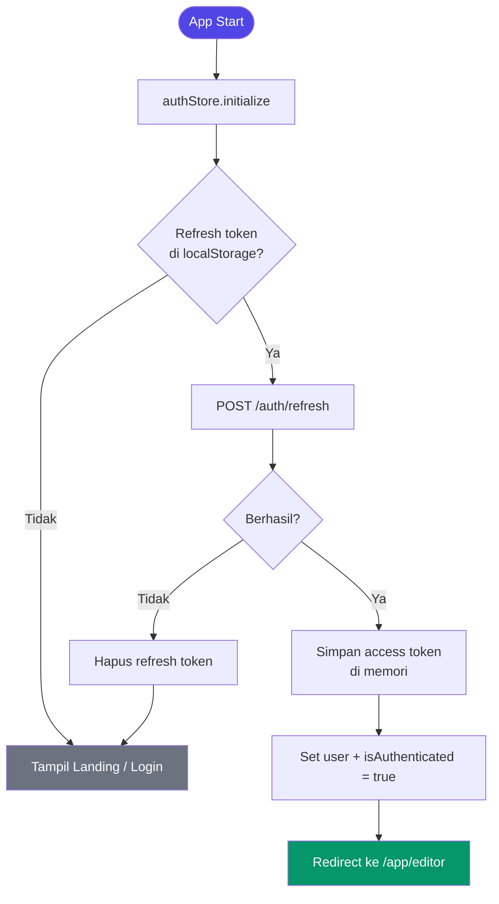
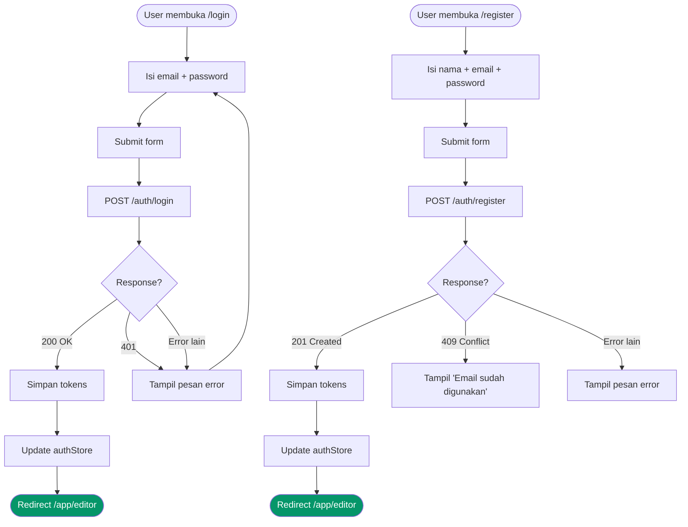
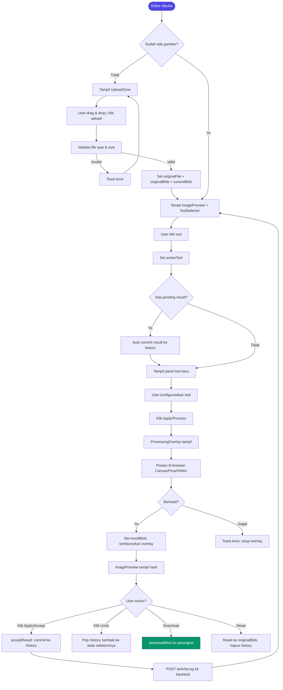
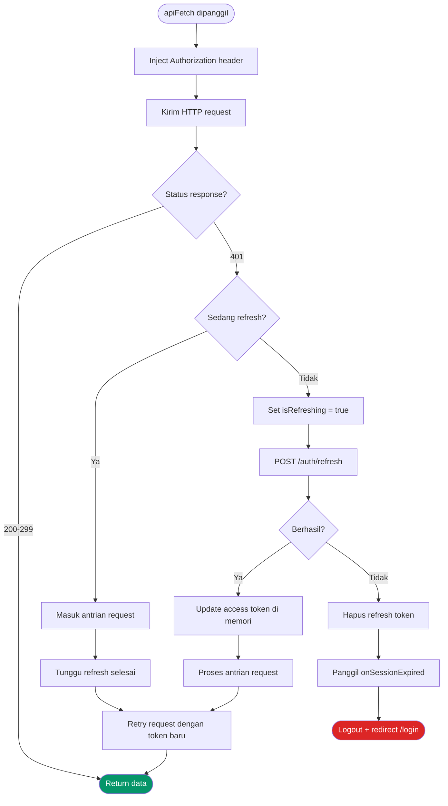
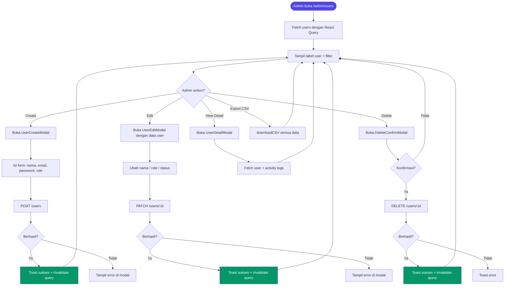

# Imegedit Frontend — Dokumentasi Teknis

> Aplikasi web editor gambar modern berbasis browser. Semua pemrosesan gambar dilakukan di sisi klien (browser) — tidak ada data yang dikirim ke server.

---

## Daftar Isi

1. [Teknologi & Library](#1-teknologi--library)
2. [Struktur Direktori](#2-struktur-direktori)
3. [Modul-Modul Aplikasi](#3-modul-modul-aplikasi)
4. [Fitur-Fitur Utama](#4-fitur-fitur-utama)
5. [Flowchart](#5-flowchart)
6. [Routing & Guard](#6-routing--guard)
7. [State Management](#7-state-management)
8. [API Layer](#8-api-layer)
9. [Tipe Data (Types)](#9-tipe-data-types)
10. [Komponen UI](#10-komponen-ui)
11. [Utility Functions](#11-utility-functions)

---

## 1. Teknologi & Library

### Core Framework

| Teknologi | Versi | Fungsi |
|-----------|-------|--------|
| React | 19.2.7 | UI framework utama |
| TypeScript | 6.0.2 | Type-safe development |
| Vite | 8.1.0 | Build tool & dev server |

### Routing & State

| Library | Versi | Fungsi |
|---------|-------|--------|
| react-router-dom | 7.18.0 | Client-side routing |
| zustand | 5.0.14 | Global state management |
| @tanstack/react-query | 5.101.1 | Server state caching & refetching |

### Styling

| Library | Versi | Fungsi |
|---------|-------|--------|
| tailwindcss | 4.3.1 | Utility-first CSS framework |
| clsx | 2.1.1 | Conditional className builder |
| tailwind-merge | 3.6.0 | Resolve konflik Tailwind class |

### Pemrosesan Gambar

| Library | Versi | Fungsi |
|---------|-------|--------|
| @imgly/background-removal | 1.7.0 | AI background removal berbasis ONNX (browser) |
| pica | 10.0.2 | Resize gambar kualitas tinggi (Lanczos) |
| react-image-crop | 11.1.2 | Komponen crop interaktif |

### UI & UX

| Library | Versi | Fungsi |
|---------|-------|--------|
| lucide-react | 1.21.0 | Ikon SVG modern |
| react-hot-toast | 2.6.0 | Notifikasi toast |
| file-saver | 2.0.5 | Download file cross-browser |
| date-fns | 4.4.0 | Formatting tanggal (locale Indonesia) |

### Development Tools

| Tool | Versi | Fungsi |
|------|-------|--------|
| ESLint | 10.5.0 | Linting kode |
| @vitejs/plugin-react | 6.0.2 | React Fast Refresh |
| Babel + React Compiler | — | Optimasi kompilasi |

---

## 2. Struktur Direktori

```
imegedit-frontend/
├── public/
│   └── (static assets)
├── src/
│   ├── api/                        # HTTP client & endpoint definitions
│   │   ├── client.ts               # Base fetcher + token refresh logic
│   │   ├── auth.ts                 # Login, register, logout, getMe
│   │   ├── users.ts                # CRUD user (admin)
│   │   ├── activityLogs.ts         # Log aktivitas editor
│   │   └── auditLog.ts             # Audit trail HTTP request
│   │
│   ├── components/
│   │   ├── common/                 # Logic/guard components
│   │   │   ├── ProtectedRoute.tsx  # Guard: harus login
│   │   │   ├── AdminRoute.tsx      # Guard: harus admin
│   │   │   ├── ErrorBoundary.tsx   # Error recovery UI
│   │   │   ├── EmptyState.tsx      # Tampilan kosong
│   │   │   ├── SearchInput.tsx     # Input search dengan debounce
│   │   │   └── QueryErrorMessage.tsx
│   │   │
│   │   ├── layout/                 # Template halaman
│   │   │   ├── AuthLayout.tsx      # Wrapper login/register
│   │   │   ├── AppLayout.tsx       # Layout user (header + nav)
│   │   │   └── AdminLayout.tsx     # Layout admin (sidebar)
│   │   │
│   │   └── ui/                     # Reusable UI primitives
│   │       ├── Button.tsx
│   │       ├── Input.tsx
│   │       ├── Select.tsx
│   │       ├── Badge.tsx
│   │       ├── Modal.tsx
│   │       ├── Table.tsx
│   │       ├── Pagination.tsx
│   │       └── Spinner.tsx
│   │
│   ├── hooks/
│   │   └── useTableState.ts        # Shared pagination + sort state
│   │
│   ├── modules/                    # Feature modules (halaman + komponen lokal)
│   │   ├── landing/
│   │   │   └── LandingPage.tsx
│   │   ├── auth/
│   │   │   ├── LoginPage.tsx
│   │   │   └── RegisterPage.tsx
│   │   ├── editor/
│   │   │   ├── pages/
│   │   │   │   ├── EditorPage.tsx
│   │   │   │   └── MyLogsPage.tsx
│   │   │   └── components/
│   │   │       ├── UploadZone.tsx
│   │   │       ├── ImagePreview.tsx
│   │   │       ├── ToolSelector.tsx
│   │   │       ├── ActionBar.tsx
│   │   │       ├── ProcessingOverlay.tsx
│   │   │       └── panels/
│   │   │           ├── CropPanel.tsx
│   │   │           ├── ResizePanel.tsx
│   │   │           ├── RemoveBgPanel.tsx
│   │   │           ├── ReformatPanel.tsx
│   │   │           ├── UpscalePanel.tsx
│   │   │           └── RotatePanel.tsx
│   │   ├── admin/
│   │   │   ├── pages/
│   │   │   │   ├── DashboardPage.tsx
│   │   │   │   ├── UsersPage.tsx
│   │   │   │   ├── ActivityLogsPage.tsx
│   │   │   │   └── AuditLogPage.tsx
│   │   │   └── components/
│   │   │       ├── StatCard.tsx
│   │   │       ├── UserCreateModal.tsx
│   │   │       ├── UserEditModal.tsx
│   │   │       ├── UserDetailModal.tsx
│   │   │       ├── DeleteConfirmModal.tsx
│   │   │       └── MetadataModal.tsx
│   │   └── common/
│   │       └── NotFoundPage.tsx
│   │
│   ├── store/
│   │   ├── authStore.ts            # Auth state + session management
│   │   └── editorStore.ts          # Editor state + undo/redo history
│   │
│   ├── types/
│   │   ├── api.ts                  # Response & request types
│   │   └── editor.ts               # Tool & format types
│   │
│   ├── utils/
│   │   ├── cn.ts                   # Tailwind className merger
│   │   ├── format.ts               # Date, bytes, role, error formatting
│   │   ├── canvas.ts               # Canvas ↔ Blob ↔ Image conversions
│   │   ├── csv.ts                  # Export ke CSV
│   │   ├── download.ts             # Trigger download file
│   │   └── picaResize.ts           # Wrapper pica (Lanczos resize)
│   │
│   ├── App.tsx                     # Root + auth initialization
│   ├── main.tsx                    # React DOM entry point
│   ├── router.tsx                  # Route definitions
│   └── index.css                   # Global styles
│
├── vite.config.ts
├── tsconfig.json
└── package.json
```

---

## 3. Modul-Modul Aplikasi

### 3.1 Modul Landing (`modules/landing/`)

Halaman marketing publik yang bisa diakses tanpa login.

| Komponen | Deskripsi |
|----------|-----------|
| `LandingPage.tsx` | Hero section, showcase 5 fitur, panduan penggunaan, testimoni, FAQ accordion, section privasi, CTA, navbar responsif dengan mobile menu, footer |

---

### 3.2 Modul Auth (`modules/auth/`)

Autentikasi pengguna.

| Komponen | Deskripsi |
|----------|-----------|
| `LoginPage.tsx` | Form email + password, toggle show/hide password, error display, redirect ke editor setelah login |
| `RegisterPage.tsx` | Form nama + email + password, deteksi email duplikat (error 409), redirect ke editor setelah register |

---

### 3.3 Modul Editor (`modules/editor/`)

Inti aplikasi — editor gambar berbasis browser.

#### Pages

| Halaman | Deskripsi |
|---------|-----------|
| `EditorPage.tsx` | Layout 3-panel: kiri (daftar tool), tengah (preview gambar), kanan (panel tool aktif). Mengelola ProcessingOverlay dengan progress. |
| `MyLogsPage.tsx` | Riwayat aktivitas pengguna. Tabel dengan filter tool, sorting, dan pagination. |

#### Komponen Editor

| Komponen | Deskripsi |
|----------|-----------|
| `UploadZone.tsx` | Area drag & drop / klik untuk upload gambar |
| `ImagePreview.tsx` | Tampilan before/after gambar dengan komparasi |
| `ToolSelector.tsx` | 6 tombol pilihan tool (Crop, Resize, Remove BG, Reformat, Upscale, Rotate) |
| `ActionBar.tsx` | Tombol Download, Undo, Reset |
| `ProcessingOverlay.tsx` | Overlay loading dengan persentase progress |

#### Panel Tool

| Panel | Tool | Deskripsi |
|-------|------|-----------|
| `CropPanel.tsx` | Crop | Crop interaktif dengan preset rasio aspek (1:1, 16:9, 4:3, 3:2, free) |
| `ResizePanel.tsx` | Resize | Ubah dimensi dengan lock aspect ratio, menggunakan Pica Lanczos |
| `RemoveBgPanel.tsx` | Remove Background | Hapus background dengan AI (ONNX), pilihan output: transparan, warna solid, gambar custom |
| `ReformatPanel.tsx` | Reformat | Konversi format (JPEG ↔ PNG ↔ WebP) + quality slider |
| `UpscalePanel.tsx` | Upscale/Downscale | Preset upscale (1.5×, 2×, 3×, 4×) dan downscale (75%, 50%, 25%), atau dimensi custom |
| `RotatePanel.tsx` | Rotate/Flip | Rotasi (90° kanan/kiri, 180°) dan flip (horizontal/vertikal) |

---

### 3.4 Modul Admin (`modules/admin/`)

Panel manajemen untuk pengguna dengan role admin (roleId = 2).

#### Pages

| Halaman | Deskripsi |
|---------|-----------|
| `DashboardPage.tsx` | 4 stat card (total user, admin, aktivitas, audit), tabel aktivitas terbaru, grafik top tool, auto-refetch 60 detik |
| `UsersPage.tsx` | Tabel user dengan CRUD lengkap, filter role & status, search, export CSV |
| `ActivityLogsPage.tsx` | Log penggunaan tool oleh semua user, filter tool, export CSV |
| `AuditLogPage.tsx` | Audit trail HTTP request, filter method & status code |

#### Komponen Admin

| Komponen | Deskripsi |
|----------|-----------|
| `StatCard.tsx` | Card metrik dengan ikon, nilai, dan label |
| `UserCreateModal.tsx` | Form buat user baru (nama, email, password, role) |
| `UserEditModal.tsx` | Form edit user (nama, role, status aktif) |
| `UserDetailModal.tsx` | Detail profil user + log aktivitas terakhir |
| `DeleteConfirmModal.tsx` | Dialog konfirmasi hapus dengan nama user |
| `MetadataModal.tsx` | Viewer JSON metadata aktivitas |

---

### 3.5 Modul Common (`modules/common/`, `components/`)

| Komponen | Deskripsi |
|----------|-----------|
| `NotFoundPage.tsx` | Halaman 404 dengan tombol kembali ke beranda |
| `ProtectedRoute.tsx` | Redirect ke `/login` jika belum autentikasi |
| `AdminRoute.tsx` | Redirect ke `/app/editor` jika bukan admin |
| `ErrorBoundary.tsx` | Menangkap error React dan menampilkan fallback UI |
| `EmptyState.tsx` | Tampilan state kosong dengan ikon dan pesan |
| `SearchInput.tsx` | Input search dengan debounce 300ms |

---

## 4. Fitur-Fitur Utama

### 4.1 Autentikasi & Sesi

- Register dan login dengan email + password
- Refresh token otomatis pada respons 401
- Multiple request queuing selama token sedang di-refresh
- Auto-logout jika refresh token kadaluarsa
- Refresh token disimpan di `localStorage`, access token di memori (lebih aman)

### 4.2 Editor Gambar (Browser-Side)

Semua tool berjalan di browser menggunakan Canvas API tanpa upload ke server.

| Fitur | Detail |
|-------|--------|
| **Crop** | Drag-to-crop interaktif, preset rasio 1:1 / 16:9 / 4:3 / 3:2 / bebas |
| **Resize** | Ubah resolusi dengan kualitas Lanczos (via Pica), lock aspek rasio |
| **Remove Background** | AI model ONNX (@imgly), output transparan/warna/gambar |
| **Reformat** | Konversi JPEG ↔ PNG ↔ WebP, slider kualitas untuk lossy |
| **Upscale/Downscale** | Preset perbesaran & pengecilan, atau dimensi custom |
| **Rotate & Flip** | Rotasi 90°/180°, flip horizontal/vertikal |

### 4.3 Undo/Redo History

- History menyimpan maksimal 10 Blob (gambar di memori)
- Undo mengembalikan ke state sebelumnya
- Reset mengembalikan ke gambar original yang diupload
- Hasil tool dicommit ke history saat tool berpindah atau tombol Accept ditekan

### 4.4 Activity Logging

Setiap penggunaan tool dicatat ke backend secara fire-and-forget:

| Tool | Metadata yang Dicatat |
|------|-----------------------|
| crop | `{ aspectRatio?, cropW, cropH }` |
| resize | `{ originalW, originalH, newW, newH }` |
| remove-background | `{ model: 'isnet' }` |
| reformat | `{ from, to, quality }` |
| upscale/downscale | `{ originalW, originalH, newW, newH, tool }` |
| rotate | `{ degrees }` atau `{ flip: 'horizontal'/'vertical' }` |

### 4.5 Admin Panel

| Fitur | Detail |
|-------|--------|
| Dashboard | Statistik real-time, grafik top tool, aktivitas terbaru |
| Manajemen User | Create/Read/Update/Delete, filter role & status, export CSV |
| Activity Logs | Semua log penggunaan tool oleh seluruh user |
| Audit Log | Trail lengkap semua HTTP request (method, path, status, IP, user agent) |

### 4.6 Export CSV

Tersedia di halaman Users, Activity Logs, dan Audit Log dengan format UTF-8 BOM agar kompatibel dengan Microsoft Excel.

---

## 5. Flowchart

### 5.1 Alur Autentikasi



---

### 5.2 Alur Login & Register



---

### 5.3 Alur Editor Gambar (Umum)



---

### 5.4 Alur Token Refresh (API Client)



---

### 5.5 Alur Admin — Manajemen User



---

### 5.6 Alur Remove Background (AI)

```mermaid
flowchart TD
    A([User pilih Remove BG]) --> B[User pilih output type]
    B --> C{Output type?}
    C -- Transparent --> D[Output PNG transparan]
    C -- Solid Color --> E[User pilih warna fill]
    C -- Custom Image --> F[User upload gambar background]

    D & E & F --> G[Klik Remove Background]
    G --> H[ProcessingOverlay: 0%]
    H --> I[blobToImageElement]
    I --> J[@imgly/background-removal]
    J --> K[Download model ONNX jika belum cache]
    K --> L[Update progress 10% → 90%]
    L --> M[Inferensi AI browser-side]
    M --> N{Output type?}
    N -- Transparent --> O[Return PNG alpha channel]
    N -- Solid Color --> P[Canvas: fill warna + composite gambar]
    N -- Custom Image --> Q[Canvas: draw background + composite gambar]
    O & P & Q --> R[Set resultBlob]
    R --> S[Progress 100%, tutup overlay]
    S --> T[POST activityLog ke backend]
    T --> U([Tampil hasil di ImagePreview])

    style A fill:#4f46e5,color:#fff
    style U fill:#059669,color:#fff
```

---

## 6. Routing & Guard

```
/                               → LandingPage (publik)
/login                          → LoginPage (AuthLayout)
/register                       → RegisterPage (AuthLayout)

/app/*  [ProtectedRoute]
  /app/editor                   → EditorPage (AppLayout)
  /app/logs                     → MyLogsPage (AppLayout)

/admin/*  [ProtectedRoute + AdminRoute]
  /admin/dashboard              → DashboardPage (AdminLayout)
  /admin/users                  → UsersPage (AdminLayout)
  /admin/logs                   → ActivityLogsPage (AdminLayout)
  /admin/audit                  → AuditLogPage (AdminLayout)

/*                              → NotFoundPage (404)
```

**Lazy Loading:** Semua halaman di-lazy load via `React.lazy()` untuk code splitting otomatis.

**Guards:**
- `ProtectedRoute` — cek `isAuthenticated`; jika tidak, redirect ke `/login`
- `AdminRoute` — cek `user.roleId === 2`; jika tidak, redirect ke `/app/editor`

---

## 7. State Management

### authStore (Zustand)

```
State:
  user: User | null
  isAuthenticated: boolean
  isInitializing: boolean

Actions:
  initialize()    → Coba restore sesi dari refresh token di localStorage
  login()         → POST /auth/login, simpan tokens, set user
  register()      → POST /auth/register, simpan tokens, set user
  logout()        → POST /auth/logout, bersihkan semua state
  setUser()       → Update data user

Derived:
  useIsAdmin()    → user.roleId === 2
```

**Token Strategy:**
- `refreshToken` → `localStorage` (persisten antar sesi)
- `accessToken` → variabel memori modul (tidak tersimpan di storage)

---

### editorStore (Zustand)

```
State:
  originalFile: File | null         → File asli yang diupload
  originalBlob: Blob | null         → Blob asal (untuk reset)
  currentBlob: Blob | null          → Gambar yang sedang diedit
  resultBlob: Blob | null           → Preview hasil tool (belum di-commit)
  activeTool: ToolName | null       → Tool yang aktif saat ini
  isProcessing: boolean
  processingProgress: number (0-100)
  processingMessage: string
  history: Blob[]                   → Max 10 item

Actions:
  setFile(file)           → Init editor dengan file baru
  setCurrentBlob(blob)    → Update gambar yang sedang diedit
  setResult(blob)         → Simpan preview hasil tool
  setActiveTool(tool)     → Ganti tool (auto-commit jika ada pending result)
  acceptResult()          → Commit result ke history, update currentBlob
  undo()                  → Kembalikan ke history[-1]
  resetToOriginal()       → Kembalikan ke originalBlob, hapus history
  resetEditor()           → Kosongkan semua state
```

---

## 8. API Layer

### client.ts — HTTP Client

```typescript
apiFetch(path: string, options?: RequestInit): Promise<T>
```

- Inject `Authorization: Bearer <accessToken>` otomatis
- Pada respons 401: antri request, refresh token, retry
- Pada refresh gagal: trigger `onSessionExpired()` → logout

---

### Endpoint Summary

| Module | Method | Endpoint | Fungsi |
|--------|--------|----------|--------|
| auth | POST | `/auth/register` | Daftar akun baru |
| auth | POST | `/auth/login` | Login |
| auth | POST | `/auth/logout` | Logout |
| auth | POST | `/auth/refresh` | Refresh access token |
| auth | GET | `/auth/me` | Data user yang login |
| users | GET | `/users` | List user (admin, paginasi + filter) |
| users | GET | `/users/:id` | Detail user |
| users | POST | `/users` | Buat user baru (admin) |
| users | PATCH | `/users/:id` | Update user (admin) |
| users | DELETE | `/users/:id` | Hapus user (admin) |
| activity | POST | `/activity-logs` | Catat aktivitas tool |
| activity | GET | `/activity-logs/me` | Log milik user sendiri |
| activity | GET | `/activity-logs` | Semua log (admin) |
| audit | GET | `/audit-logs` | Audit trail HTTP (admin) |

---

## 9. Tipe Data (Types)

### User

```typescript
interface User {
  id: string
  name: string
  email: string
  roleId: number        // 1 = User, 2 = Admin
  active: boolean
  createdAt?: string
}
```

### AuthResponse

```typescript
interface AuthResponse {
  accessToken: string
  refreshToken: string
  user: User
}
```

### ActivityLog

```typescript
interface ActivityLog {
  id: string
  userId: string
  toolName: 'crop' | 'resize' | 'remove-background' | 'reformat' | 'upscale' | 'downscale' | 'rotate'
  metadata: Record<string, unknown> | null
  ipAddress: string
  createdAt: string
  user?: { name: string; email: string }
}
```

### AuditLog

```typescript
interface AuditLog {
  id: string
  userId: string | null
  action: string
  method: 'GET' | 'POST' | 'PATCH' | 'DELETE'
  path: string
  statusCode: number
  ipAddress: string
  userAgent: string
  createdAt: string
  user?: { name: string; email: string }
}
```

### PaginatedResponse

```typescript
interface PaginatedResponse<T> {
  data: T[]
  meta: {
    page: number
    limit: number
    total: number
    totalPages: number
    hasNextPage: boolean
    hasPrevPage: boolean
  }
}
```

### Editor Types

```typescript
type ToolName = 'crop' | 'resize' | 'remove-background' | 'reformat' | 'upscale' | 'downscale' | 'rotate'
type OutputFormat = 'image/jpeg' | 'image/png' | 'image/webp'
```

---

## 10. Komponen UI

| Komponen | Props Utama | Fitur |
|----------|-------------|-------|
| `Button` | variant, size, isLoading, leftIcon, rightIcon | primary/secondary/ghost/danger × sm/md/lg |
| `Input` | label, error, hint, leftElement, rightElement | Focus ring, border merah saat error |
| `Select` | label, error, options, placeholder | Custom chevron, disabled state |
| `Badge` | variant | default/success/warning/danger/info/purple |
| `Modal` | isOpen, onClose, title, size, footer | Portal-based, Escape/click-outside untuk tutup |
| `Table` | columns, data, isLoading, onSort | Sortable headers, skeleton loading, row click |
| `Pagination` | page, totalPages, onChange | Smart page numbers (±2 + first/last) |
| `Spinner` | size, className | Loading indicator |

---

## 11. Utility Functions

### canvas.ts

| Fungsi | Output | Keterangan |
|--------|--------|------------|
| `blobToImageElement(blob)` | `Promise<HTMLImageElement>` | Load blob sebagai elemen img |
| `imageToCanvas(img)` | `HTMLCanvasElement` | Gambar ke canvas |
| `canvasToBlob(canvas, mimeType, quality)` | `Promise<Blob>` | Canvas ke blob dengan format & kualitas |
| `blobToCanvas(blob)` | `Promise<HTMLCanvasElement>` | Shortcut blob → img → canvas |

### format.ts

| Fungsi | Contoh Output |
|--------|---------------|
| `formatDate(date)` | `"28 Jun 2026, 14:30"` |
| `formatRelative(date)` | `"2 jam yang lalu"` |
| `formatBytes(bytes)` | `"2.5 MB"` |
| `formatRole(roleId)` | `"Admin"` / `"User"` |
| `extractErrorMessage(err)` | Pesan error user-friendly dari berbagai format |

### csv.ts

```typescript
downloadCSV(rows: Record<string, unknown>[], columns: Column[], filename: string): void
```
Export CSV dengan UTF-8 BOM (kompatibel Microsoft Excel).

### download.ts

```typescript
downloadBlob(blob: Blob, filename: string): void
getOutputFilename(originalName: string, tool: ToolName, ext?: string): string
// Contoh: "foto.jpg" + "crop" → "foto_crop.jpg"
```

### picaResize.ts

Wrapper pica dengan algoritma Lanczos (quality: 3) untuk resize kualitas tinggi.

### cn.ts

```typescript
cn(...inputs: ClassValue[]): string
// Gabungkan clsx + tailwind-merge untuk resolve konflik class Tailwind
```

---

## Batasan Teknis

| Batasan | Nilai |
|---------|-------|
| Ukuran file maksimum | 30 MB |
| Maksimum upscale | 4× |
| Maksimum undo steps | 10 langkah per sesi |
| Format input | JPEG, PNG, WebP, GIF, BMP |
| Format output | JPEG, PNG, WebP |
| Browser minimum | Chrome 90+, Firefox 90+, Safari 14+, Edge 90+ |

---

## Konfigurasi Build (Vite)

| Konfigurasi | Nilai |
|-------------|-------|
| Backend URL | Env `BACKEND_URL` (default: `http://localhost:3000`) |
| Dev server port | Env `PORT` (default: 5173) |
| API proxy | `/api/*` → backend server |
| @imgly/background-removal | Exclude dari optimisasi (WASM) |

---

*Dokumentasi ini di-generate berdasarkan source code pada branch `master`, commit `51dccda`.*
