# Backend Documentation — ImageEdit

## Daftar Isi

- [Teknologi yang Digunakan](#teknologi-yang-digunakan)
- [Struktur Database](#struktur-database)
- [Modul-Modul Backend](#modul-modul-backend)
  - [Auth Module](#1-auth-module)
  - [Users Module](#2-users-module)
  - [Roles Module](#3-roles-module)
  - [Activity Logs Module](#4-activity-logs-module)
  - [Log History Module](#5-log-history-module)
- [Mekanisme Audit Trail](#mekanisme-audit-trail)
- [Konfigurasi Environment](#konfigurasi-environment)

---

## Teknologi yang Digunakan

### Core Framework

| Paket | Versi | Keterangan |
|---|---|---|
| `@nestjs/core` | ^11.0.1 | Framework utama NestJS |
| `@nestjs/common` | ^11.0.1 | Utilitas umum NestJS |
| `@nestjs/platform-express` | ^11.0.1 | HTTP adapter berbasis Express |

### Database

| Paket | Versi | Keterangan |
|---|---|---|
| `typeorm` | ^1.0.0 | ORM untuk TypeScript |
| `@nestjs/typeorm` | ^11.0.1 | Integrasi TypeORM dengan NestJS |
| `pg` | ^8.21.0 | Driver PostgreSQL |

### Autentikasi & Otorisasi

| Paket | Versi | Keterangan |
|---|---|---|
| `@nestjs/jwt` | ^11.0.2 | Pengelolaan JWT |
| `@nestjs/passport` | ^11.0.5 | Integrasi Passport.js |
| `passport` | ^0.7.0 | Middleware autentikasi |
| `passport-jwt` | ^4.0.1 | Strategi JWT untuk Passport |
| `bcrypt` | ^6.0.0 | Hashing password (10 salt rounds) |

### Konfigurasi & Utilitas

| Paket | Versi | Keterangan |
|---|---|---|
| `@nestjs/config` | ^4.0.4 | Manajemen environment variable |
| `@nestjs/schedule` | ^6.1.3 | Cron job scheduling |
| `class-validator` | ^0.15.1 | Validasi DTO via decorator |
| `class-transformer` | ^0.5.1 | Transformasi objek/DTO |
| `rxjs` | ^7.8.1 | Reactive programming |

### Development

| Paket | Keterangan |
|---|---|
| TypeScript | Bahasa utama |
| Jest | Unit & integration testing |
| ESLint + Prettier | Linting & formatting |
| NestJS CLI | Code generator & build tool |

---

## Struktur Database

### Diagram Relasi Antar Tabel

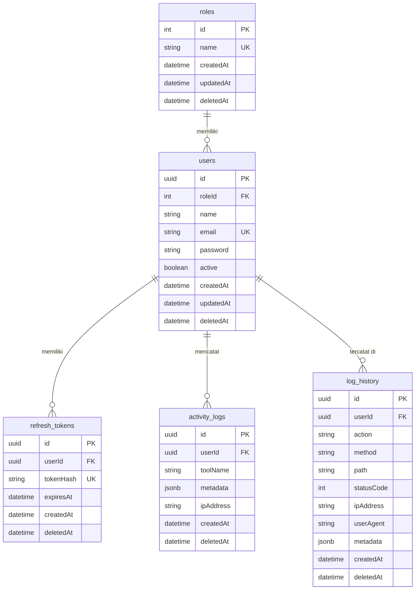

### Detail Setiap Tabel

#### Tabel `roles`

| Kolom | Tipe | Keterangan |
|---|---|---|
| `id` | `int` (PK, auto-increment) | Identitas unik role |
| `name` | `varchar` (UNIQUE) | Nama role (misal: `user`, `admin`) |
| `createdAt` | `timestamp` | Waktu dibuat |
| `updatedAt` | `timestamp` | Waktu diperbarui |
| `deletedAt` | `timestamp` (nullable) | Soft delete marker |

**Data default:** `user`, `admin`

---

#### Tabel `users`

| Kolom | Tipe | Keterangan |
|---|---|---|
| `id` | `uuid` (PK) | Identitas unik user |
| `roleId` | `int` (FK → roles.id) | Referensi role |
| `name` | `varchar` | Nama lengkap |
| `email` | `varchar` (UNIQUE) | Alamat email |
| `password` | `varchar` | Hash bcrypt (tidak dikirim ke response) |
| `active` | `boolean` (default: `true`) | Status aktif akun |
| `createdAt` | `timestamp` | Waktu dibuat |
| `updatedAt` | `timestamp` | Waktu diperbarui |
| `deletedAt` | `timestamp` (nullable) | Soft delete marker |

---

#### Tabel `refresh_tokens`

| Kolom | Tipe | Keterangan |
|---|---|---|
| `id` | `uuid` (PK) | Identitas unik token |
| `userId` | `uuid` (FK → users.id) | Pemilik token |
| `tokenHash` | `varchar` (UNIQUE) | Hash SHA-256 dari raw token |
| `expiresAt` | `timestamp` | Waktu kadaluarsa |
| `createdAt` | `timestamp` | Waktu diterbitkan |
| `deletedAt` | `timestamp` (nullable) | Soft delete = token dicabut |

> Raw token tidak pernah disimpan. Hanya hash SHA-256 yang tersimpan di database.

---

#### Tabel `activity_logs`

| Kolom | Tipe | Keterangan |
|---|---|---|
| `id` | `uuid` (PK) | Identitas unik log |
| `userId` | `uuid` (FK → users.id) | User yang melakukan aktivitas |
| `toolName` | `varchar` | Nama fitur/tool yang digunakan |
| `metadata` | `jsonb` (nullable) | Data tambahan (misal: parameter input) |
| `ipAddress` | `varchar` (nullable) | IP address request |
| `createdAt` | `timestamp` | Waktu aktivitas |
| `deletedAt` | `timestamp` (nullable) | Soft delete marker |

---

#### Tabel `log_history`

| Kolom | Tipe | Keterangan |
|---|---|---|
| `id` | `uuid` (PK) | Identitas unik log |
| `userId` | `uuid` (FK → users.id, nullable) | User pengirim request (null jika unauthenticated) |
| `action` | `varchar` | Deskripsi aksi (misal: `POST /users/:id`) |
| `method` | `varchar` | HTTP method (`POST`, `PATCH`, dll.) |
| `path` | `varchar` | Path URL request |
| `statusCode` | `int` (nullable) | HTTP response status code |
| `ipAddress` | `varchar` (nullable) | IP address pengirim |
| `userAgent` | `varchar` (nullable) | Browser/client info |
| `metadata` | `jsonb` (nullable) | Params & body (password/token disanitasi ke `***`) |
| `createdAt` | `timestamp` | Waktu request |
| `deletedAt` | `timestamp` (nullable) | Soft delete marker |

---

## Modul-Modul Backend

### 1. Auth Module

**Lokasi:** `src/auth/`

**Deskripsi:** Menangani registrasi, login, refresh token, logout, dan pengecekan sesi aktif.

#### Endpoint

| Method | Path | Guard | Keterangan |
|---|---|---|---|
| `POST` | `/auth/register` | — | Daftarkan user baru |
| `POST` | `/auth/login` | — | Login dan terima token |
| `POST` | `/auth/refresh` | — | Perbarui access token |
| `POST` | `/auth/logout` | — | Cabut refresh token |
| `GET` | `/auth/me` | JWT | Info user yang sedang login |

#### Flowchart: Register

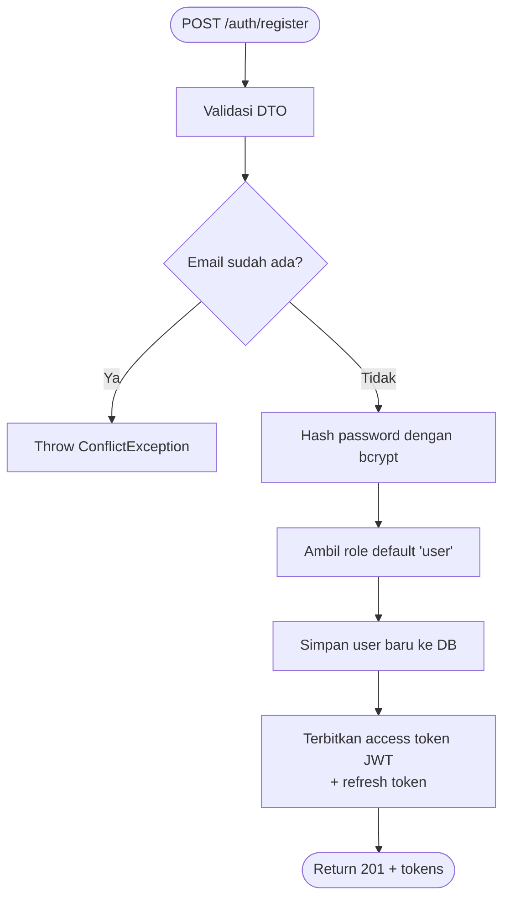

#### Flowchart: Login

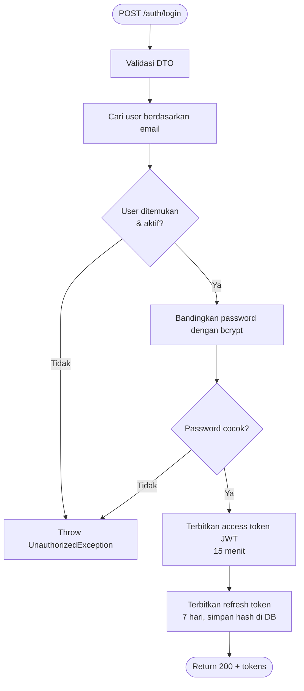

#### Flowchart: Refresh Token

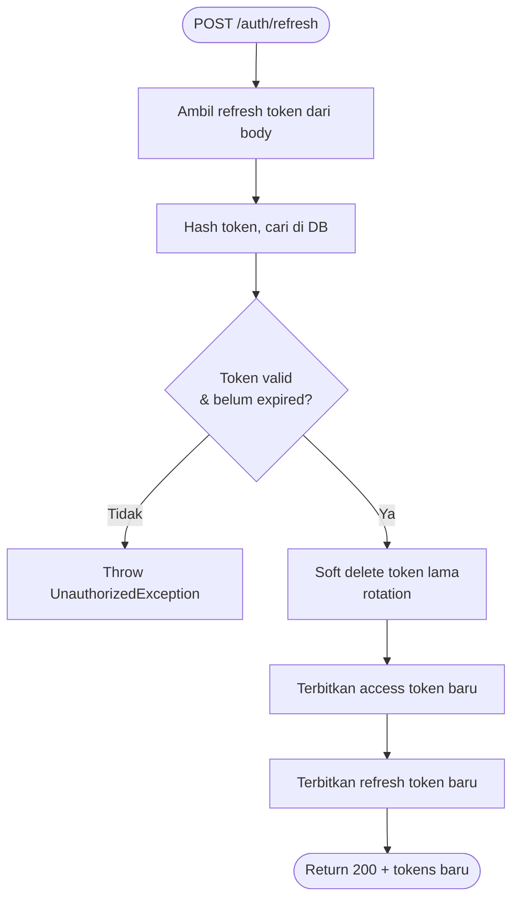

#### Flowchart: Logout

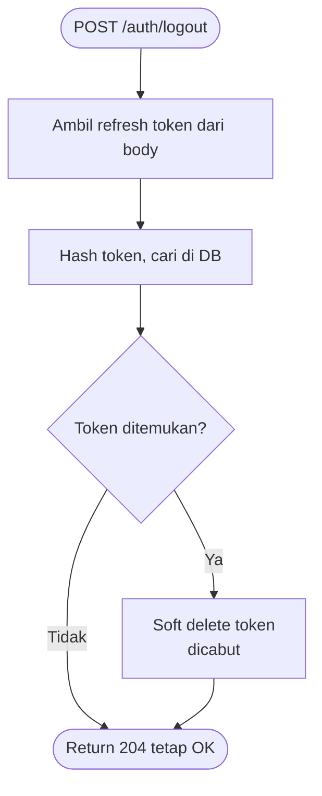

---

### 2. Users Module

**Lokasi:** `src/users/`

**Deskripsi:** Manajemen user oleh admin — CRUD lengkap dengan paginasi, filter, dan pencarian.

#### Endpoint

| Method | Path | Guard | Keterangan |
|---|---|---|---|
| `POST` | `/users` | JWT + Admin | Buat user baru |
| `GET` | `/users` | JWT + Admin | Daftar semua user (paginated) |
| `GET` | `/users/:id` | JWT + Admin | Detail user berdasarkan UUID |
| `PATCH` | `/users/:id` | JWT + Admin | Perbarui data user |
| `DELETE` | `/users/:id` | JWT + Admin | Soft delete user |

#### Flowchart: Create User (Admin)

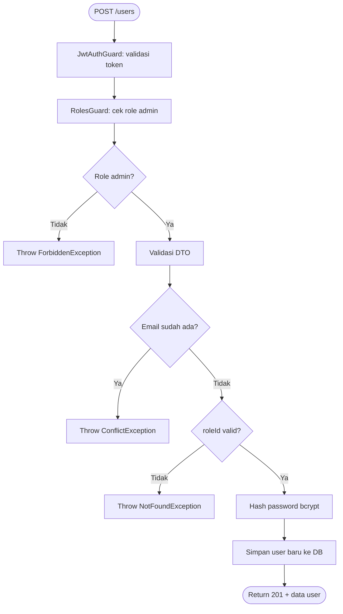

#### Flowchart: List Users

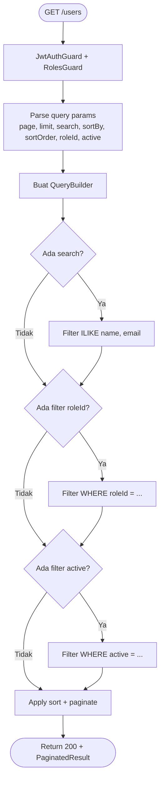

#### Flowchart: Soft Delete User

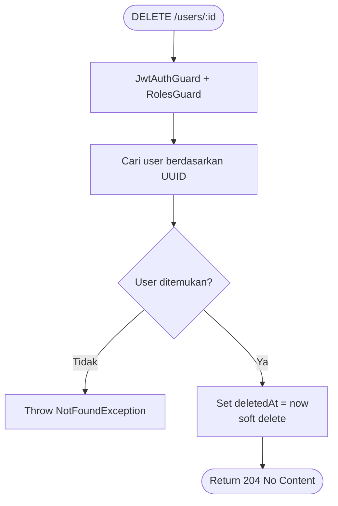

---

### 3. Roles Module

**Lokasi:** `src/roles/`

**Deskripsi:** Modul internal tanpa controller publik. Digunakan untuk seeding role default dan pencarian role.

#### Fungsi Utama

| Fungsi | Keterangan |
|---|---|
| `seedDefaults()` | Buat role `user` dan `admin` jika belum ada (idempotent) |
| `findById(id)` | Cari role berdasarkan ID numerik |
| `findOrCreate(name)` | Cari atau buat role berdasarkan nama |

#### Flowchart: Seed Default Roles (App Bootstrap)

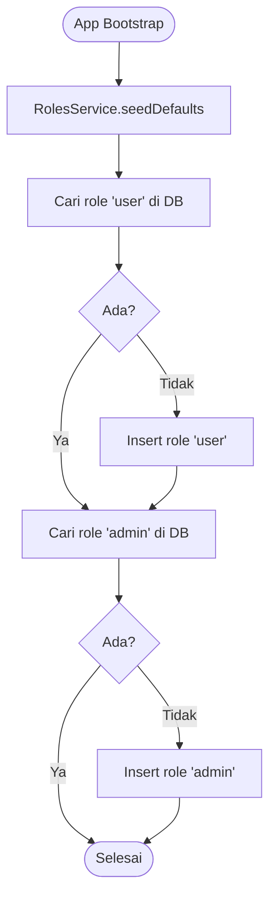

---

### 4. Activity Logs Module

**Lokasi:** `src/activity-logs/`

**Deskripsi:** Mencatat aktivitas penggunaan fitur/tool oleh user. Dapat diakses oleh user sendiri maupun admin.

#### Endpoint

| Method | Path | Guard | Keterangan |
|---|---|---|---|
| `POST` | `/activity-logs` | JWT | Catat aktivitas tool oleh user login |
| `GET` | `/activity-logs` | JWT | Riwayat aktivitas user sendiri (paginated) |
| `GET` | `/activity-logs/all` | JWT + Admin | Semua aktivitas semua user (paginated) |

#### Flowchart: Create Activity Log

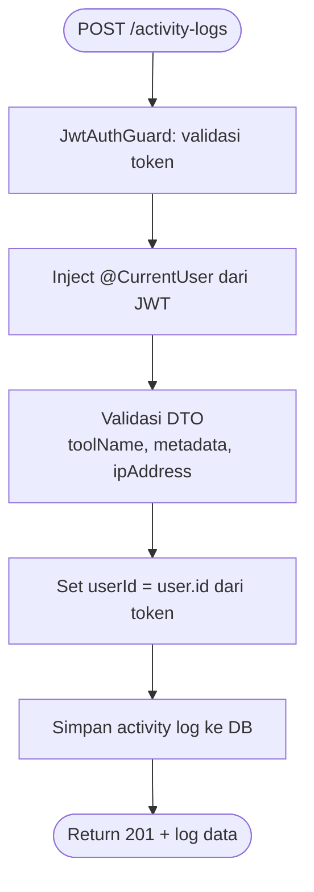

#### Flowchart: Get Own Activity Logs

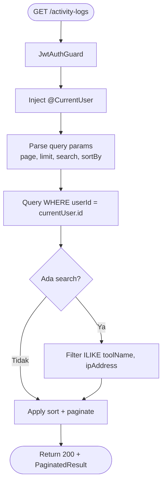

---

### 5. Log History Module

**Lokasi:** `src/log-history/`

**Deskripsi:** Audit trail otomatis untuk setiap HTTP request yang mengubah state (`POST`, `PUT`, `PATCH`, `DELETE`). Dijalankan via interceptor dan exception filter global.

#### Endpoint

| Method | Path | Guard | Keterangan |
|---|---|---|---|
| `GET` | `/log-history` | JWT + Admin | Query semua log HTTP (paginated) |

#### Komponen Global

| Komponen | Tipe | Keterangan |
|---|---|---|
| `AuditLogInterceptor` | Global Interceptor | Mencatat request yang **berhasil** |
| `AuditExceptionFilter` | Global Exception Filter | Mencatat request yang **gagal** (4xx/5xx) |

#### Flowchart: Alur Audit Trail Otomatis

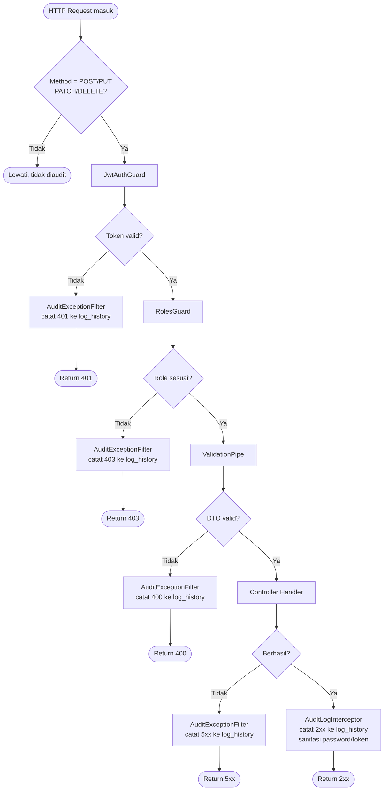

#### Flowchart: Query Log History (Admin)

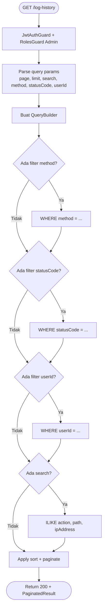

---

## Mekanisme Audit Trail

### Perlindungan Data Sensitif

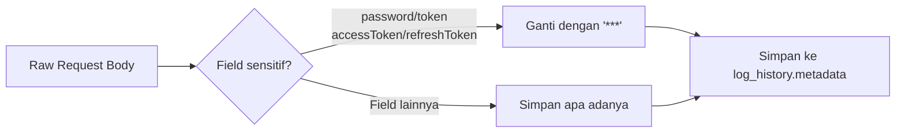

### Siklus Hidup Refresh Token

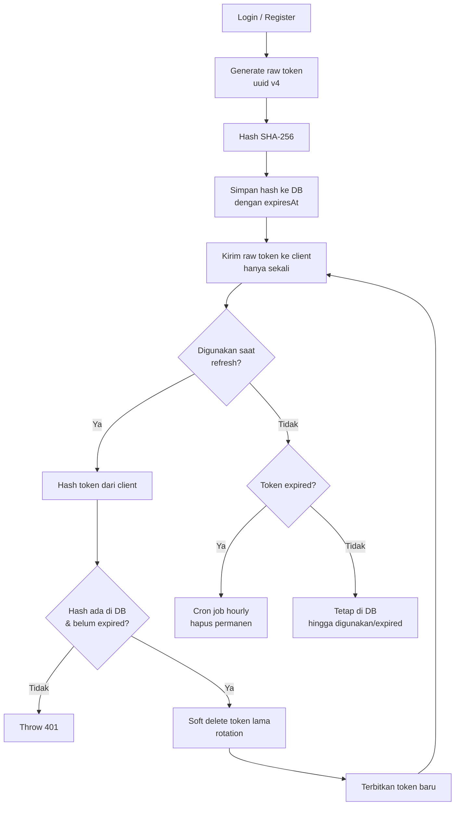

---

## Konfigurasi Environment

```env
# Server
PORT=3000

# Database PostgreSQL
DATABASE_HOST=localhost
DATABASE_PORT=5432
DATABASE_USER=postgres
DATABASE_PASSWORD=your_password
DATABASE_NAME=imagedit
DATABASE_SYNCHRONIZE=true        # true di development, false di production

# JWT
JWT_SECRET=your_very_secret_key
JWT_ACCESS_EXPIRES_IN=15m        # masa berlaku access token
REFRESH_EXPIRES_DAYS=7           # masa berlaku refresh token (hari)

# bcrypt
BCRYPT_SALT_ROUNDS=10

# CORS
CORS_ORIGIN=http://localhost:5173

# Admin Seeder
ADMIN_EMAIL=admin@example.com
ADMIN_PASSWORD=ChangeMe123!
ADMIN_NAME=Administrator
```

> **Peringatan:** Set `DATABASE_SYNCHRONIZE=false` di environment production untuk menghindari perubahan schema otomatis yang tidak terduga.

---

## Struktur Direktori

```
src/
├── app.module.ts              # Root module
├── main.ts                    # Entry point aplikasi
├── seed.ts                    # Seeder standalone
│
├── auth/                      # Autentikasi & otorisasi
│   ├── auth.module.ts
│   ├── auth.controller.ts
│   ├── auth.service.ts
│   ├── refresh-token.entity.ts
│   ├── refresh-tokens.service.ts
│   ├── jwt.strategy.ts
│   ├── jwt-auth.guard.ts
│   ├── roles.guard.ts
│   └── decorators/
│       ├── current-user.decorator.ts
│       └── roles.decorator.ts
│
├── users/                     # Manajemen user (admin)
│   ├── users.module.ts
│   ├── users.controller.ts
│   ├── users.service.ts
│   └── user.entity.ts
│
├── roles/                     # Manajemen role
│   ├── roles.module.ts
│   ├── roles.service.ts
│   └── role.entity.ts
│
├── activity-logs/             # Log aktivitas user
│   ├── activity-logs.module.ts
│   ├── activity-logs.controller.ts
│   ├── activity-logs.service.ts
│   └── activity-log.entity.ts
│
├── log-history/               # Audit trail HTTP request
│   ├── log-history.module.ts
│   ├── log-history.controller.ts
│   ├── log-history.service.ts
│   ├── log-history.entity.ts
│   ├── audit-log.interceptor.ts
│   └── audit-exception.filter.ts
│
└── common/                    # Utilitas bersama
    ├── dto/
    │   └── pagination-query.dto.ts
    ├── pagination/
    │   └── paginate.ts
    └── audit/
        └── audit-log.util.ts
```
